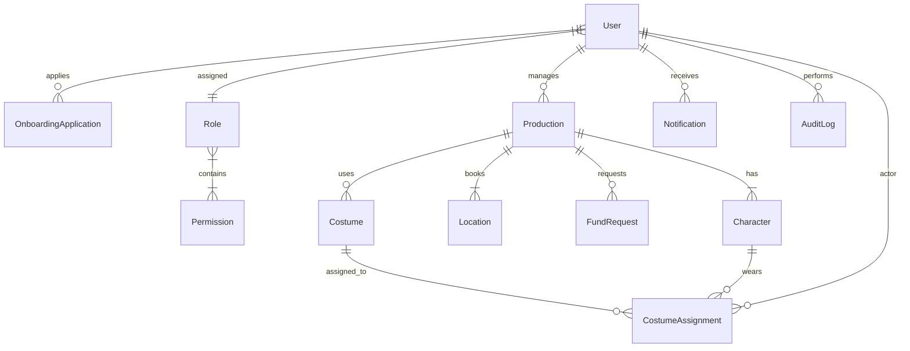

# Tendagon — CineDesk Pro: Film Production Management Platform

An enterprise-grade, RBAC-driven Film Production Management Platform engineered with TypeScript, Node.js, Express, InversifyJS (Dependency Injection), MongoDB / Mongoose, React, TailwindCSS, Zustand, Ant Design, and Cloudinary.

---

## 🌟 Executive Summary & Task Parity

CineDesk Pro is built from the ground up to solve internal film production logistics across productions, cast & crew, onboarding workflows, locations, fund approvals, costume inventory, and granular authorization.

### Key Architectural Pillars:
1. **Clear Separation of Contractor Type vs System Role vs Permissions**:
   - **Contractor Type** (Freelancer, Cast, Supplier, Cast-Crew Agent, TCS Team, Intern) defines who the applicant is during the 6-step onboarding process.
   - **System Role** (Super Admin, Production Admin, Production Manager, Finance Manager, Location Manager, Costume Manager, Cast, Crew) defines the assigned role.
   - **Granular Permissions** (30+ atomic permission keys like `productions.view`, `funds.approve`, `locations.book`) dynamically govern API routes and UI widgets.
2. **Dynamic Live RBAC & Immediate Revocation**:
   - Permissions are queried live from the database per authenticated request (`authenticate.ts` re-populates role + permissions).
   - Removing a permission from a role in the DB restricts active users instantly without re-login.
3. **Resource-Level Authorization (Bonus & Core)**:
   - Production Managers can only modify productions they manage.
   - Self-approval prohibition on fund requests (`requesterId !== approverId`).
   - Location date-conflict prevention (`(existingStart <= newEnd) && (existingEnd >= newStart)`).
   - Costume availability state checks before assignment.
4. **Cloudinary File Upload & Storage**:
   - Direct streaming uploads of IDs, tax documents, location photos, permits, and costume images with safe fallback.
5. **6-Step Contractor Onboarding & Admin Approval**:
   - Public Signup -> Welcome -> Personal Information -> Financial -> Documents -> Sign -> Done (`pending_review`) -> Admin Review -> Approval & Role Assignment.

---

## 🚀 Quick Start Guide

### Prerequisites
- Node.js v18+ and `npm`
- MongoDB running locally or MongoDB Atlas connection string
- Cloudinary credentials (pre-configured in `.env`)

### 1. Backend Setup
```bash
cd backend
npm install
npm run seed     # Wipes & seeds 30 permissions, 8 roles, 11 users, productions, locations, funds, costumes, and logs
npm run dev      # Starts backend API server on http://localhost:5000
```
- **API Base URL**: `http://localhost:5000/api`
- **Interactive Swagger 3.0 API Docs**: `http://localhost:5000/api-docs`

### 2. Frontend Setup
```bash
cd frontend
npm install
npm run dev      # Starts Vite React dev server on http://localhost:5173
```
- Open browser at `http://localhost:5173`

---

## 🔑 Test Credentials (All 8 Roles + Test Accounts)

All seeded test accounts use the password: **`Password123!`**

| Email | System Role | Contractor Type | Purpose & Dashboard Scope |
| :--- | :--- | :--- | :--- |
| `superadmin@tendagon.test` | Super Admin | TCS Team | Full system access (`*` permission), RBAC role/permission management, system metrics |
| `prodadmin@tendagon.test` | Production Admin | TCS Team | Production administration, onboarding reviews, user role assignments |
| `pm@tendagon.test` | Production Manager | Freelancer | Manages assigned productions (*Dune*, *Cyberpunk*), cast/crew roster, location booking, fund requests |
| `finance@tendagon.test` | Finance Manager | TCS Team | Fund request reviews, approvals, rejection reasons & disbursements |
| `location@tendagon.test` | Location Manager | Freelancer | Filming location directory, permit management, shooting approvals |
| `costume@tendagon.test` | Costume Manager | Freelancer | Costume inventory, character wardrobe assignments & return tracking |
| `cast@tendagon.test` | Cast Member | Cast | Actor view: Assigned characters (*Paul Atreides*, *V*), call times, assigned costumes |
| `crew@tendagon.test` | Crew Member | Freelancer | Crew view: Assigned production rosters, call sheets & profile |
| `applicant@tendagon.test` | Pending Review | Cast | Test account with completed 6-step application in `pending_review` |
| `changes@tendagon.test` | Changes Requested | Freelancer | Test account with application in `changes_requested` (allows applicant resubmission) |
| `deactivated@tendagon.test` | Deactivated Account | Cast | **Security edge case**: Login returns `HTTP 403 Forbidden` |

---

## 🏗️ Domain Models & Database Schema

The database consists of 12 normalized Mongoose models:



- **Users**: Authentication credentials, status (`active`, `pending_onboarding`, `deactivated`), contractor type, role reference, application link.
- **Roles & Permissions**: Granular permissions (slug-based) grouped into roles; managed dynamically via Admin UI.
- **OnboardingApplications**: Complete 6-step form data (personal, financial, Cloudinary document URLs, signature timestamp, reviewer comments, status).
- **Productions**: Title, dates, manager, budget (total vs spent), assigned cast & crew, characters, notes.
- **Locations**: Coordinates, address, images, permits, contact, rental cost, booking calendar array with date range conflict tracking.
- **FundRequests**: Production, requester, category, requested & approved amount, justification, required date, approver, status history.
- **Costumes & Assignments**: Category, size, production, character, condition before/after, assignment actor, status (`Available`, `Assigned`, `Reserved`, `Maintenance`).
- **AuditLogs & Notifications**: Automated action auditing and in-app notifications for state changes.

---

## 🔒 Permission Matrix Summary

| Permission Key | Super Admin | Prod Admin | Prod Mgr | Finance Mgr | Location Mgr | Costume Mgr | Cast / Crew |
| :--- | :---: | :---: | :---: | :---: | :---: | :---: | :---: |
| `users.view` / `users.create` | ✅ | ✅ | ❌ | ❌ | ❌ | ❌ | ❌ |
| `roles.view` / `roles.manage` | ✅ | ❌ | ❌ | ❌ | ❌ | ❌ | ❌ |
| `onboarding.review` | ✅ | ✅ | ❌ | ❌ | ❌ | ❌ | ❌ |
| `productions.view` | ✅ | ✅ | ✅ | ✅ | ✅ | ✅ | ✅ |
| `productions.create` / `update` | ✅ | ✅ | ✅ (Own) | ❌ | ❌ | ❌ | ❌ |
| `locations.view` | ✅ | ✅ | ✅ | ❌ | ✅ | ❌ | ❌ |
| `locations.create` / `manage` | ✅ | ✅ | ❌ | ❌ | ✅ | ❌ | ❌ |
| `locations.book` | ✅ | ✅ | ✅ | ❌ | ✅ | ❌ | ❌ |
| `funds.view` | ✅ | ✅ | ✅ | ✅ | ❌ | ❌ | ❌ |
| `funds.request` | ✅ | ✅ | ✅ | ❌ | ✅ | ✅ | ❌ |
| `funds.approve` / `reject` | ✅ | ❌ | ❌ | ✅ | ❌ | ❌ | ❌ |
| `costumes.view` | ✅ | ✅ | ✅ | ❌ | ❌ | ✅ | ✅ (Own) |
| `costumes.create` / `assign` | ✅ | ❌ | ❌ | ❌ | ❌ | ✅ | ❌ |
| `audit_logs.view` | ✅ | ❌ | ❌ | ❌ | ❌ | ❌ | ❌ |

*(See [PERMISSION_MATRIX.md](file:///e:/MY%20WORK-SPACE/machinetask-tendagon/PERMISSION_MATRIX.md) for the full 30-permission breakdown).*

---

## 🛡️ Edge Cases Handled & Tested

1. **Unauthorized Access**: Protected API endpoints return `HTTP 403 Forbidden`; UI redirects to `/unauthorized` or displays empty states.
2. **Fund Self-Approval Prevention**: If a Finance Manager submits a fund request and tries to approve it, the backend blocks the request with `HTTP 403 Forbidden: Self-approval of fund requests is prohibited`.
3. **Location Overlap Booking**: Booking an already-booked location for overlapping dates throws `HTTP 409 Conflict: Location is already booked for the selected date range`.
4. **Costume Availability Check**: Assigning a costume with status `Assigned` or `Maintenance` throws `HTTP 409 Conflict: This costume is not available for assignment`.
5. **Duplicate Onboarding Protection**: Submitting multiple concurrent onboarding applications is blocked with `HTTP 409 Conflict`.
6. **Instant Role Revocation**: Revoking permissions from a role immediately restricts active tokens on their next API call.
7. **Deactivated User Login**: Deactivated accounts are rejected at login with `HTTP 403 Forbidden: Your account has been deactivated`.

---

## 📁 Repository Structure

```
machinetask-tendagon/
├── backend/
│   ├── src/
│   │   ├── config/             # DB connection, Inversify container, Swagger, Cloudinary
│   │   ├── controllers/        # Request handlers & interfaces
│   │   ├── entities/           # TypeScript domain interfaces
│   │   ├── middlewares/        # authenticate, requirePermission, ownership, upload, validation
│   │   ├── models/             # Mongoose schemas & models
│   │   ├── repositories/       # Data access layer
│   │   ├── routes/             # Express API routes
│   │   ├── scripts/            # Seed launcher
│   │   ├── seed/               # Permissions, roles, users & full database seed script
│   │   ├── services/           # Business logic layer
│   │   ├── stateMachines/      # Onboarding & workflow transition rules
│   │   └── utils/              # JWT, ApiError, Cloudinary, pagination, logger
│   └── tsconfig.json
├── frontend/
│   ├── src/
│   │   ├── components/         # Reusable UI library (DataTable, StatCard, Stepper, StatusBadge, etc.)
│   │   ├── constants/          # Permissions, routes, contractor types
│   │   ├── features/           # Admin, Auth, Costumes, Dashboard, Funds, Locations, Onboarding, Productions
│   │   ├── interfaces/         # Frontend TypeScript definitions
│   │   ├── routes/             # App routing and permission guards
│   │   ├── services/           # Typed Axios API clients
│   │   └── zustand/            # Global auth and UI stores
│   └── vite.config.ts
├── ARCHITECTURE.md             # Detailed system architecture document
├── PERMISSION_MATRIX.md        # Complete permission matrix specification
├── Machine_task.md             # Specification document
└── README.md
```
